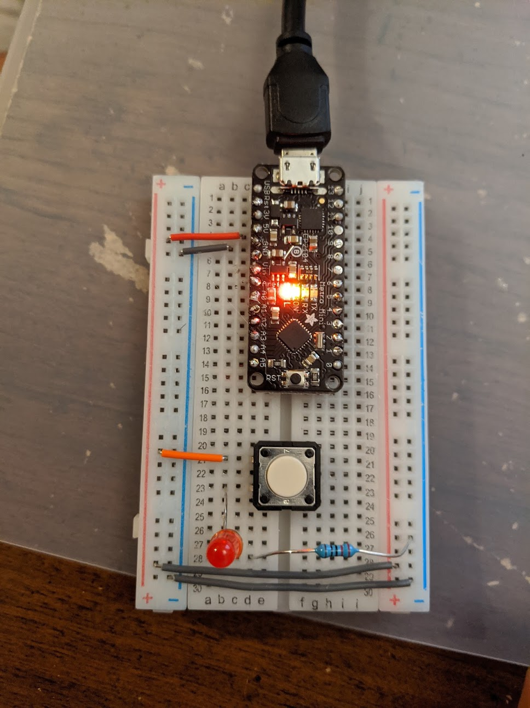

# IDD-Fa20-Lab1: Blink!

**A lab report by Omer Ifrach Student**

> Include your responses to the bold questions on your own fork of the lab activities. Include snippets of code that explain what you did. Deliverables are due next Tuesday. Post your lab reports as `README.md` pages on your GitHub, and post a link to that on your main class hub page.

We've copied the questions from the lab here. Answer them below!

## Part A. Set Up a Breadboard

## Part B. Manually Blink a LED

**a. What color stripes are on a 100 Ohm resistor?**
Brown, Black & Brown 
**b. What do you have to do to light your LED?**
Manualy push the switch to complete the circuit

## Part C. Blink a LED using Arduino

### 1. Blink the on-board LED

**a. What line(s) of code do you need to change to make the LED blink (like, at all)?**
 
 digitalWrite(LED_BUILTIN, HIGH);   // turn the LED on (HIGH is the voltage level)
 digitalWrite(LED_BUILTIN, LOW);    // turn the LED off by making the voltage LOW
  
 The digital wire lines determine the status of the LED (ON = HIGH, OFF = LOW)
 to make the LED blink, we need to make sure the LED is set to go ON and OFF. 

**b. What line(s) of code do you need to change to change the rate of blinking?**
 
delay(1000);                       // wait for a second
the lower the delay value, the faster the LED will blink

**c. What circuit element would you want to add to protect the board and external LED?**
Resistors
**d. At what delay can you no longer *perceive* the LED blinking? How can you prove to yourself that it is, in fact, still blinking?**

If both HIGH & LOW delay is set to 10, the LED flicker is Imperceptible. However,
to prove that the LED still blinks, We can simply use a different duty cycle. instead, we can leave 
the delay of the off-cycle as 1 second, then, set the delay of the on cycle to 10, or even 1. Since the off-cycle is long, it is possible to see the LED flicker.

**e. Modify the code to make your LED blink your way. Save your new blink code to your lab 1 repository, with a link on the README.md.**

[Blink Code](Lab1-_Blink.ino)

### 2. Blink your LED

**Make a video of your LED blinking, and add it to your lab submission.**

[video]
https://photos.app.goo.gl/pKjTEv4ZfSY684Kg8

## Part D. Manually fade an LED

**a. Are you able to get the LED to glow the whole turning range of the potentiometer? Why or why not?**

Yes. However, the code must be modified to output from pin 9. We also must use analogwrite rather than digitalwrite to take advantage of pulse width modulation (PWM) - providing fixed voltage, and controlling the intensity of the LED light by varying the duty cycle. the longer the on-cycle, the brighter the light and vice-versa.

## Part E. Fade an LED using Arduino

**a. What do you have to modify to make the code control the circuit you've built on your breadboard?**
The code has to initiate pin 9 to provide output (rather than the built in LED). Then, we must loop through the brightness spectrum of the LED using PWM (As explained in the previous section).

**b. What is analogWrite()? How is that different than digitalWrite()?**

digitalWrite can set a given pin to one of two states - HIGH/LOW. 
analogWrite sets a given pin with a PWM value.
