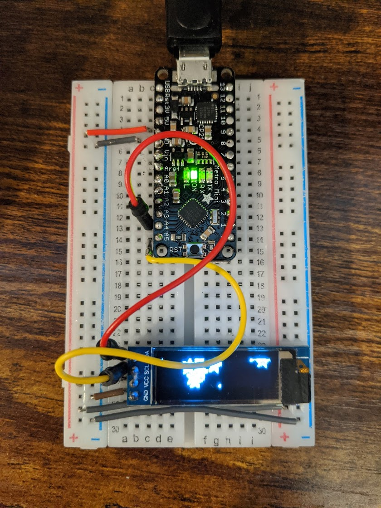

# Make a Digital Timer!

## Part B. Make a lowly Multimeter

[Lowly Code](https://github.com/OiBoii/Interactive-Lab-Hub/tree/master/Lab2/2b_lowly)

## Part D. Make your Arduino sing!

[Code For Avengers Theme](https://github.com/OiBoii/Interactive-Lab-Hub/tree/master/Lab2/2d_avengers).

**a. How would you change the code to make the song play twice as fast?**
 
Music plays twice as fast

**b. What song is playing?**
 
The Star Wars Theme Song

**a. Make a short video showing how your timer works, and what happens when time is up!**

[Video](https://github.com/OiBoii/Interactive-Lab-Hub/blob/master/Lab2/avengers.mp4)

[Melody Matlab Output](https://github.com/OiBoii/Interactive-Lab-Hub/blob/master/Lab2/Avengers_Theme.wav)
