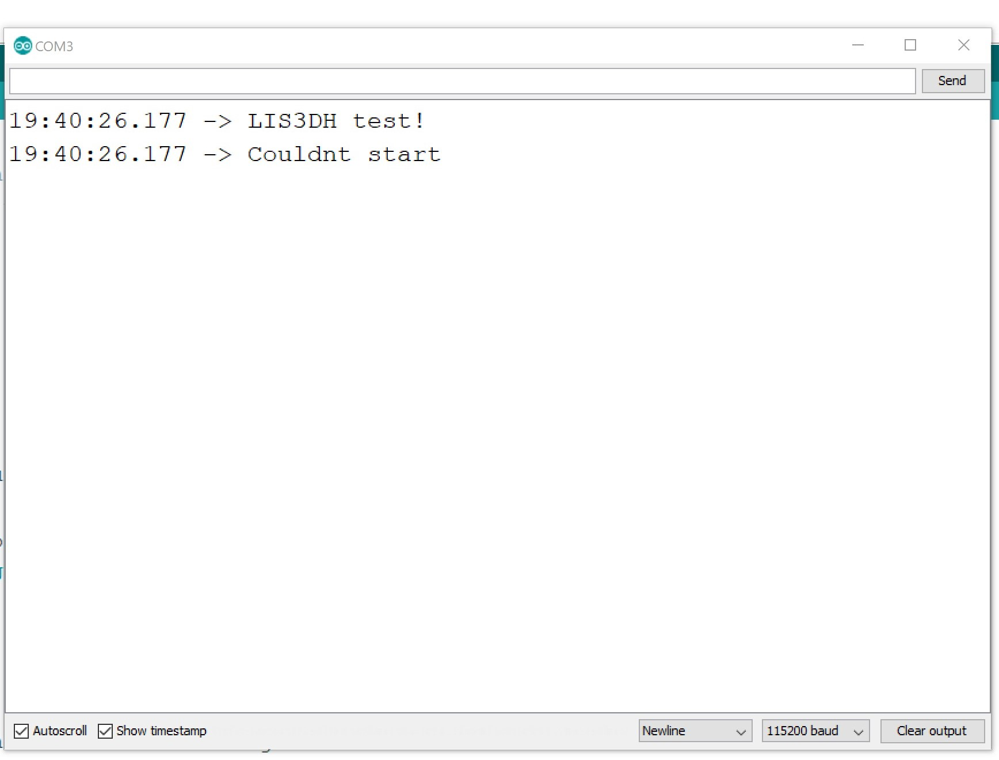
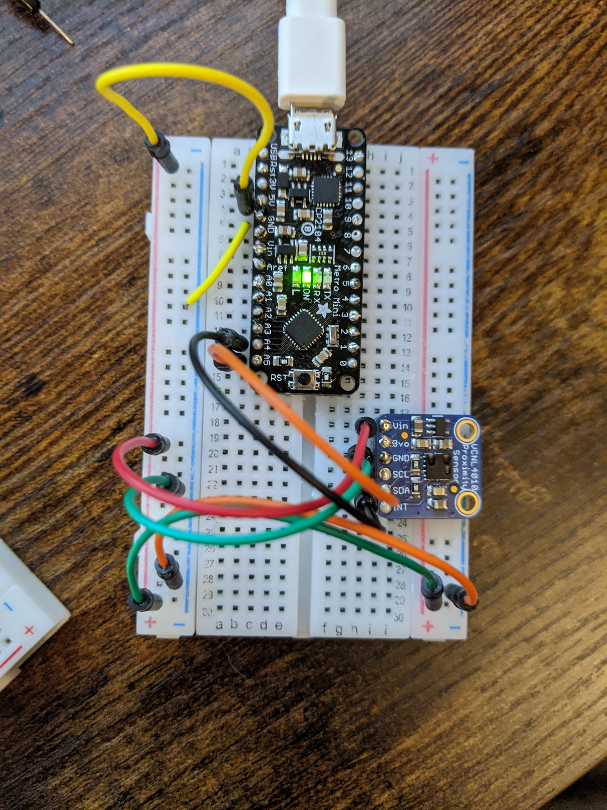

# Pre-Lab
IDEA GENERATION: The point of this week's lab is to figure out a cool interaction that you can make possible with the a micro controller which can record data generated by a sensor, and then play it back.  You could make programmable piano. You could make that records how much you toss and turn at night. You could make something that measures the changing light levels in your room. 

# Data Logger (and using cool sensors!)

For this lab, we will be experimenting with a variety of sensors, sending the data to the Arduino serial monitor, writing data to the EEPROM of the Arduino, and then playing the data back.

## Overview

What's in this lab?

A. [Writing to the Serial Monitor](#part-a--writing-to-the-serial-monitor)

B. [RGB LED](#part-b-rgb-led)

C. [Resistance & Voltage Varying Sensors](#part-c-resistance--voltage-varying-sensors)

D. [I2C Sensors](https://github.com/FAR-Lab/Developing-and-Designing-Interactive-Devices/wiki/Lab-03#part-d-i2c-sensors)

E. [Logging Values to the EEPROM and Reading Them Back](#part-f-logging-values-to-the-eeprom-and-reading-them-back)

F. [Create your own Data logger!](#part-g-create-your-own-data-logger)

## In The Report

## Part A.  Writing to the Serial Monitor
 
**a. Based on the readings from the serial monitor, what is the range of the analog values being read?**

0 to 1023

**b. How many bits of resolution does the analog to digital converter (ADC) on the Arduino have** (hint: where might you look to find this sort of thing)?

The Arduino could map the input voltage (0 to 3.3V / 5V) to integers between 0-1023. 2^*10*=1024, which requires a 0-bit analog to digital converter. This information could be found on the spec sheet.

The serial monitor currently shows values between 0-512. Hence, there are 9 ADCs in use.

## Part B. RGB LED

## Part C. Resistance & Voltage Varying Sensors 

### FSR

**a. What voltage values do you see from your force sensor?**

The code maps the force values between 0-255 (256=2^8). The maximum value the display shows is 249. This is equivalent to roughly 996/1023, which is almost 5V. 

**b. What kind of relationship does the voltage have as a function of the force applied? (e.g., linear?)**

Resistance and force are directly related (that is, when one increases - so does the other and vice versa). However, that relation ship is NOT linear.
In addition, voltage is inversely proportional to resistance because of the voltage divider (the more resistance we produce - the more current directed the other route). 
Mathematical relationship: Vo = Vcc*(R/(R+R_FSR))
That is, voltage varies inversely to resistance - logarithmically.

**c. In `Examples->Basic->Fading` the RGB LED values range from 0-255. What do you have to do so that you get the full range of output voltages from the RGB LED when using your FSR to change the LED color?**

Yes, this could be accomplished using the map() function. In the code linked [here](https://github.com/OiBoii/Interactive-Lab-Hub/blob/master/Lab4/mapFSR_LED.ino)
the RED component of the RGB is mapped to the maximum value. The link to the code can be found below.

**a. What resistance do you need to have in series to get a reasonable range of voltages from each sensor?**

* Photoresistor: 10K from A0 to GND.
* Flex sensor: 10K (same as FSR).
* Softpot: 10K from P1 to GND & 10K from P2 to Vcc.

**b. What kind of relationship does the resistance have as a function of stimulus? (e.g., linear?)**

* Photoresistor: inverse & logarithmic to the intensity of light (decreases with illumination)
* Flex sensor: linear to the degree it's bent
* Softpot: linear to touch.

## Part D. I2C Sensors 
### Accelerometer
 
**a. Include your accelerometer read-out code in your write-up.**
I have tried to implement the code with to different arduinos. Unfortunately, I belive the accelerometer is faulty, as both the test code and the code I developed to display the xyz values generate the following output immidiately:

[Code](https://github.com/OiBoii/Interactive-Lab-Hub/blob/master/Lab4/accelerometer.ino)

## Part E. Logging values to the EEPROM and reading them back
 

**a. Does it matter what actions are assigned to which state? Why?**

Yes. The potentiometer goes through the values continuously. Hence, we have to execute the steps in order (i.e. it wouldn't make much sense to go from WRITE to CLEAR to READ, because there wouldn't be any data to read). 

**b. Why is the code here all in the setup() functions and not in the loop() functions?**

Because we do not want to repeat the execution of the code more than once.

**c. How many byte-sized data samples can you store on the Atmega328?**

1024 bytes.

**d. How would you get analog data from the Arduino analog pins to be byte-sized? How about analog data from the I2C devices?**

* From analog pins: to get the analog data must divide the 1024 range by 4: 1024/4=256 (or 2^8). That way our range will be mapped between 0-255).

* From I2C devices: We can use the map() function (since each device outputs values in different ranges).

**e. Alternately, how would we store the data if it were bigger than a byte? (hint: take a look at the [EEPROMPut](https://www.arduino.cc/en/Reference/EEPROMPut) example)**

The put() function could be used to specify an address for the data to be stored at.

### 2. Design your logger
You've been thinking at a high level about a data logger and what it is used for; now you need to adapt that to the specific implementation. 

A lot of the art of data logging is being clever about how to use the sensor. Feel free to engage the teaching team for advice.

Your data logger will have two main modes: one where it logs data and another where it plays the data back. Think a little about what sensors you would like to log data from and how you would like to display your data. Create a state diagram sketch that indicates how you'd like to switch between one mode and the other, and also what you'd like the program to do in each state. This can help you decide what buttons or knobs might be useful for your design.
 
You might make changes to your design before this lab is complete.
 
**a. Turn in a copy of your final state diagram.**

## Part G. Create your own data logger!

The code reads the state of the LED and initiate the same state on upon reboot.

[Code](https://github.com/OiBoii/Interactive-Lab-Hub/blob/master/Lab4/logOnOff.ino)

**a. Record and upload a short demo video of your logger in action.**

[Video](https://github.com/OiBoii/Interactive-Lab-Hub/blob/master/Lab4/Data%20Logger.mp4)
