# MIDI CONTROLLER - MUSIC LAUNCHPAD

For the final project I am going to create my own midi controller to create music with.

## WHAT IS A MIDI CONTROLLER?

MIDI (Musical Instrument Digital Interface) is a communication standard that allows digital music gear to speak the same language. A MIDI controller is a device capable of transmitting and recieving these MIDI messages, allowing direct control over mixing programs. Buttons on MIDI controllers are programmable and could be mapped to perform many different functions to optimize workflow or produce different sounds. 

## WHY A MIDI CONTROLLER?
The reason I chode to work on this project is simple. I was more inThis is an **Interactive** Device design class - I took circuits classes before and have done my fair share of microcontroller programming projects, but it was all done with breadboard . I was more interested in creating a good design rather than a complicated circuit and complex code. I did a large portion of the research on understanding the funcitons of a MIDI controller and its different compononent. The bulk of this project was understanding the design process of a product that is intuitive to use. 

## SOME INTERESTING LEARNINGS
The main point that occured to me is that engineers take a lot of things for granted when it comes to design. people often blame themselves for not understanding how to use technology. However, it's far more likely that the engineers who designed that technology just dont understand people's needs. In other words, it's probably the designer's fault that you can't understand how to turn on the TV or use microwave at places that aren't your home. Which was a very eye openeing concept for me. My first few physical prototypes of the device (NOT the circuit - the enclosure), were fairly simple, but also not informative enough. Most prototypes were recorded, and notes were taken to document how organically the process came through at together at the end.

* I didn't consider the travel distance between the buttons
* I didn't realize that putting an ON/OFF button on the device would be confusing to people since the device coud only work when it's plugged to a computer directly. In reality when I put a push button for on and off pthe two people that i tested said they percieved the usb port as something that is used to insert content or store data on the device rather than power it.
* I made the device way too tall and top heavy (since most of the component are buttons they were mounted at the top).
* I did not realize that by mounting things on the bottom and the top of the device I wont be able to open it up after putting it together - never use glue!
* On that note - NEVER USE GLUE unless youre in pretty early stages of prototyping and material isn't expensive, and or it's absolutely necessarry. I honestly didn't realize my dislike of for glue until I had to do something a little more complicated than sticking two papers together.
* The worst thing you can do is buying really cheap materials to work with - down to the wire quality.

This would be a 25 page paper if just talked about all the mistakes I made on the way, but i'll get to all of that later.

## FULL DISCLOSURE
There are many implementations and DIY guides out there explaining in detail how to make your own midi controller. So some of the content here is obtained from different sources on the web. However, the main person to help me iterate through the design process was a friendly Youtube channel owner that made some tutorials about how to make midi controllers. He specifically asked me NOT to link his channel because he is not interested in starting to get messages from people on a regular basis. To qupte his words - " I am always happy to help when people ask for my advice, however, I would'nt want to publically volunteer this information so to not get overwhelemd with every little question someone might have, if that makes sense? If you do post these anywhere, please DO NOT link my channel! You can just say - "Thank you nerDIYmusic" and I'll know what that means. so here it is - Thank you for the help **NerDIYMusician** for your tips with the enclosure design and code - it was fun! 

### DIAGRAM 
It is important to note that MIDI in itself is NOT a soundwave, nor a musical signal of any sort! It is simply a numeric representation of an action - a hardware interrupt. It could be programmed to include a wide spectrum of properties - for example, vibration to emulate a guitar string being strummed on a synthesizer. However, at it's core, it could be a simple push of a button. The sound that is generated is not coming from the MIDI signal, the signal is converted to a MIDI instruction before its transmitted to the software, and that MIDI software is responsible to convert this instruction into sound. The controller is connected to the software via serial communication in this project.

## FORM FACTOR RESEARCH

### RAW FORM
For the sake of visualization - here is an example of what a *very simlpe* MIDI controller could look like.

### COMMERCIAL FORM 
The golden standard of MIDI Controllers is the Novation Launch Pad. An expensive yet functional device. There is an Adafruit tutorial that teaches you how to build one. But, I was hoestly a bit dicouraged by it. Especially since there are  ready-to-go kits you can order to make it. (Not to take away anything from the complexity of the process - I just felt like bein a little more creative). The cool takeaway from this design is the **feedback from the LED lights** . I really loved watching videos of people playing that thing - it's intriuing just because of the lights alone! I thought it would be cool to implement a similar feedback using the FastLED arduino library.
Also, as someone who never played a MIDI Controller - the layout was a bit overwhelming to look at. There were simply too many buttons! I decided to make a smaller version of that.

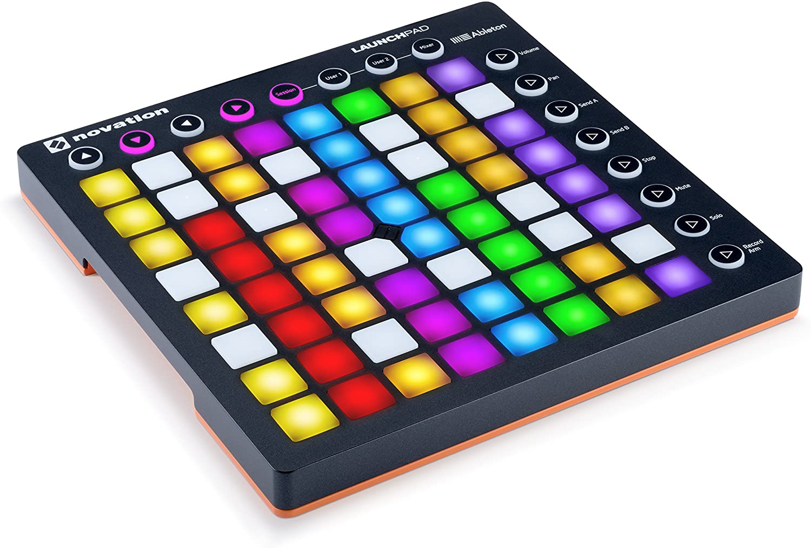

### DIY FORM
Now that's were I truly started getting excited - people make that with arcade push buttons! Yes! I was a 90's kid, and I grew up playing arcade games and love the way they feel and sound. I decided I am definitely going to use them over the silicone buttons on the Novation lauchpad. 
Note: the buttons were by far the most expensive part of the design (definitely worth it though). Since, I wanted the buttons to be able to see light coming through the buttons, I had to order ones with transparent rim.

## PAPER PROTOTYPING

### 2D PAPER PROTOTYPING 

**sketches:** I made a lot of sketches and drew a lot of inspiration from existing sources online. I just sketched as many as I could wthout thinking (it doesn't look great) but here is an example

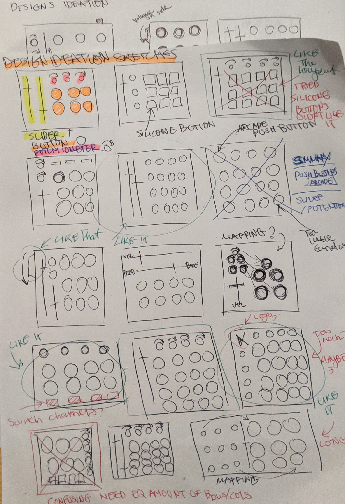

**Choosing a layout:** After that I made a first a attempt at drawing something that made sense to me. Then I wrote down some instructions I was uncertain if people will naturally understand how to do. I asked 4 different people to do basic things with the prototype and noted what they did wrong. 

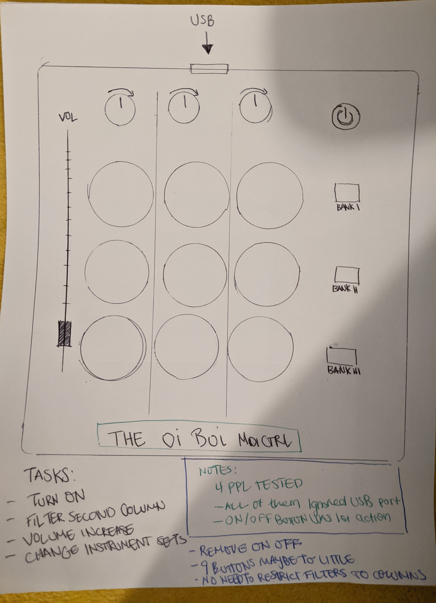

**Testing a prototype:** People performed all the right actions except one! All of the totally ignored the USB (at the top) and tried to turn the machine off simply by pressing the on/off button at the top right corner. So, I had to find a better way to go about it. 

**Takeaways**

**Too Simple:** I really never played a MIDI controller, but one day at the maker lab I saw a MIDI controller tin the form of a piano. I thought about it for a second and then I realized that I don't think I have seen an example of a 3X3 controller - which would make sense! there are 12 keys on a piano, and it would be weird to design an instrument that cannot be mapped to all the notes at once. So I decided to make the array a 4X4 (or a 3X4 at the very least) and increase the numbers of potentiometers.

* **Buttons:** After looking at multiple setups of different MIDI controllers, I decided that since I have never used this kind of device before it would be best to have less buttons then more. So, instead of making a traditional 8X8 array of small silicone buttons I decided to go with a 4X4 array of large arcade push buttons. To make up the difference, I will try to integrate a switch button on the side so that I could switch between 4 different sets of instruments while playing.

* **Sliders Vs Knobs:** I tried to play with different layouts using a piece of paper when deciding between sliders and knobs. The truth is, I couldn't tell the difference that much, both of them were reasonably comfortable to use and rather intuituitive (even with my less than ideal coordination) but ultimately, I ended up choosing to implement only knobs in the design. The simply take much less space and provide the same functionality as sliders and will allow additional sound effects to be loaded.

#### 3D(ISH) PROTOTYPING

**I am very happy that I did not skip that part of the experimentation because I realized two important things aobut the design. 
   * I will not need an off button since the controller always have to be connected to the computer and will be powered by the Arduino.
   * I originally set out to get 16 buttons - but I actually needed 17! (16 for the main array of synths + 1 to switch between sets of instruments.)
  
*  **Extra Push Button:** ~~I do not know not know where to place the extra button at this point and will have to construct a cardboard prototype for that reason.~~
    * **Update:** found a location for the switch button! I did not intend ot uplpad any pictures of the cardboard prototype to the repo because it was not the most elegant        process of trial and error for me. But from the pictures I took with my phone I noticed my left (non-dominant) hand was resting on the left side of the box. I did it subconciously to hold the box in place when I was trying to pretend to play the push buttons. Noenetheless, after seeing that, it occured to me that this was the most natural position for it because I consistently placed my prototype to the right of my monitor so I could control it with my right hand. That assigned my left hand with the task of traveling between the keyboard and the device (I fully committed to play pretend here, imagining I was actually going through the motinons of uploading different synths and watching the feedback on the screen). Which is why, I now know where to put the switch button!

* **Location of the potentiometers:** I immidiately found out that I wanted to leave space for some of the potentiometers on the top of the box. Since they have a higher profile then all the other components, it wouldn't make much sens to place them closer to me as they would obstruct the push buttons array. This way they will also be accessible to be controlled with both my hands.

  * **Update:**   After I realized I wanted to use 8 potentiometers instead of 4, I could'nt determine whether I wanted them to be on left or the right side of the arcade push buttons array. I initially thought it would be less comfortable for me to use my left hand to control them, but then I realized it wouldn't make much sense to put them on the right side because that would delegate to much responsibility to my right hand. For sanity check, I looked at many other designs and confirmed that this was indeed the case - more often than not, knobs and sliders were placed to the left of the keys.

## DIGITAL PROTOTYPING
Choosign the components allowed me to have a little more structure when I went about desigining the enclosure since I knew what were the measurements I needed to consider.

#### COMPONENTS

* **The Micro Controller:** I looked for a class compliant MIDI chip (plug & play enabled). In other words, the controller cpould be directly connected to the computer without requiring an interface at all. Both the Teensy board and the Arduino Pro Micro were considered. 
Even though I wouldn't have had to buy a multiplexer had I gone with the teensy board (since it has 25 input pins - exactly as much as I need). I opted for an Arduino Pro Micro (18 input pins) + Multiplexer because there is simply much more resources available for it. 
* **Lights:** I chose the RGB LED strips because they would be much more convinient to use without a breadboard. 
* **Buttons:** 16 transparent arcade buttons for the top plate + one on the side. The buttons don't have to be entirely clear, but it is important that they are at least somewhat seathrough so that the LED lights could be seen. This is important not just for decorative purposes - it is also crucial because the light is going to indicate the type of feedback the button is providing (on click, continuous output, etc.)

#### CARDBOARD PROTOTYPING 

I used a free template I found on the internet as box frame to the design. I read the data sheets of the components to make I am cutting the right sized holes in the box. I emailed NerDIY again to ask for his opinion and he rocommended that I include a hole for a spacer in the middle to prevent 'flex' from occuring at the middle of the top plate when its applied with pressure. He also recommended that I design separators, since I am using LED lights and wanted to light up indvidual buttons as I pushed them - that way I light wouldnt 'leak' from one place to another - this was a very useful tip but caused me to dislike glue for a while.

That was almost the final design. Again, most of these are just component measurements. The shape of the interlocking components is just a template I found on the internet.

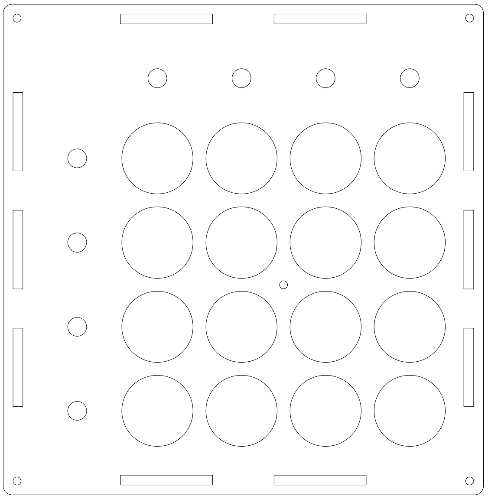
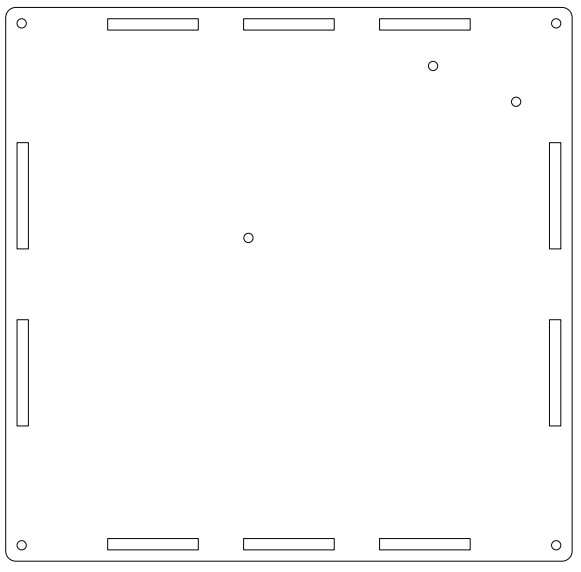

I used CNC machining to laser cut the prototypes at this point. I was using scraps from the MakerLab, but many pieces were a tad too small so, I decided to shrink the model 50% just to see how it looks. harmless right? well potentially. It did cause some issues for me down the road. But I am so glad I did that, becase It tought me to pay attention to things I wouldn't otherwise notice.

I couldn't figure out why it was so difficult to fit the parts together - I scaled everything together and I just didn't understand why this was happening with a template I found online that had thousands of positive reviews. I looked at the printing measurements and they seemed fine. Something had to fit no? Yet, there I was in the MakerLab, and I couldn't find anything that would fit aside from some thin wood veneers. I had to smoosh the cardboards with my boots to make it fit - and even then, it barely did. It took me a second, but I finally realized - of course nothing fits they were! I scaled everything down by 50% without accouting for the thickness of the material I was using - so the slots were so much smaller than they would be in the real size model.

Things were coming together real nicely from a design perspective though!

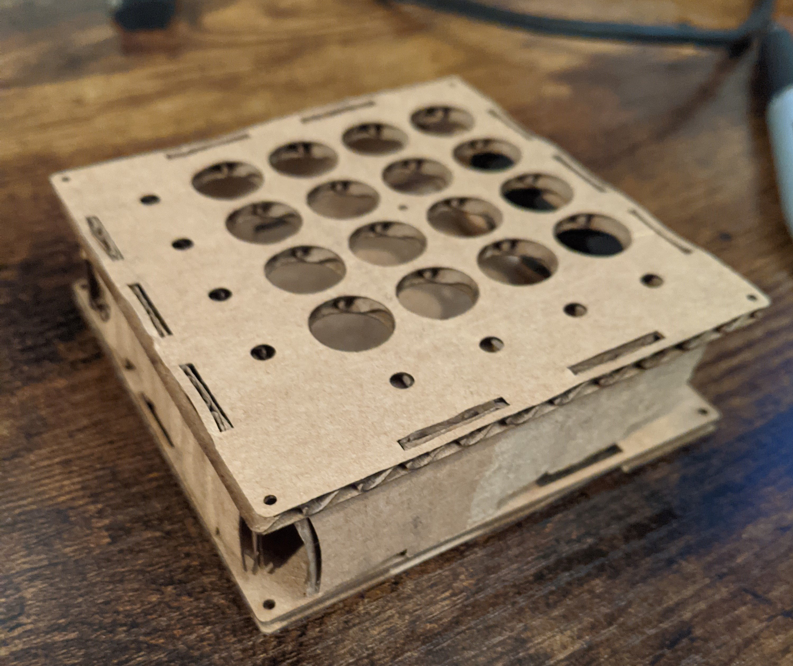

### FINAL ENCCLOSURE

**OOPS** 

When the buttons and the rest of the components arrived (I ordered white acrylic to print the enclosure since I thought it would look nice with the RGB LEDs). I went to the make lab and was eager to start cutting the material. After testing the printer on a cardboard again, I realized I accidentally saved the file last time when I scaled it, so I had to scale it up again. I SHOULD HAVE printed a real size cardboard prototype at this point but didn't have a lot of time that day, so I skipped the full size cardboard print and moved right on to use the material so I could pu some things together at home. OOPS! 

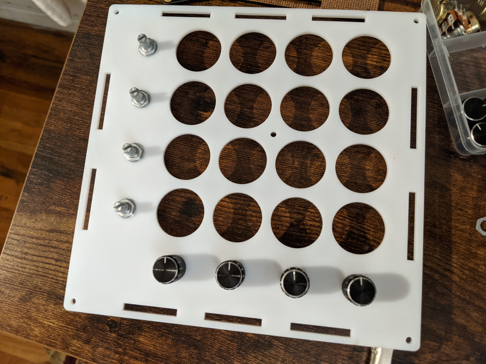

I don't know what happened, but I think I somehow rounded the numbers after scaling them - which resulted in the holes I made for the buttons being too large! it wasn't a problem for the potentiometerssi nce I used wahers to mount them anyway, but the push buttons just slid right through! 

**ANOTHER OOPS** 
I almost ordered another shipment of white acrylic but really wanted to start tweaking the circuit (since I knew I had a very busy schedule in the next few weeks). So I decided to sacrifice some beauty by using material from the maker lab. I found a light blue transparent acrylic sheet and cut it with the right hole measuremeants that I needed. after installing the components together I realized, that the box template I was using was really not working for me. The notches on the top of the box were sticking out too far out and it was uncomforable to use. Only when I stacked both plates on top of the notches they seemed to be propery surfaced. 

Why would this box get so many positive reviews if it was made so poorly?! I literally needed two 1/8" plates to make this work for me, and it's not like it stated that anywhere... Why not just make the notches shorter? Or just tell me to use 1/4"... Oh!! that's right it was made for 1/4" panels - which is why I made sure to adjust the slots for the notches to fit 1/8" inches. But that also meant that the these notches had to stick 1/4" out! I just never thought of that.

That ended up working out for me because I realized I actually really loved the look! - the device didn't feel significant;y heavier or clunckier, yet the top panel had less flex, and a more refined look to it - though I definitely wanted it to be transparent and not blue.

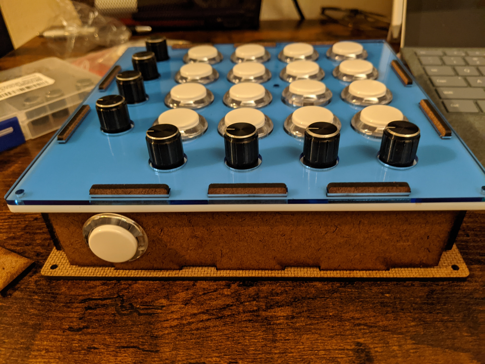

## CIRCUIT DESIGN

### MINI BREADBOARD CIRCUIT AND CODE
No issues here! the prototype includes an array 4 buttons (1 line from the array) and 4 potentiometers. I looked at a few tutorias and experimented with a few components I had to design the circuit.

Code:
Fritzing Schematic:
Picture circuit:
Video:

**Takeaways:** 
* Circuit and code work!
* need to extend the code if interested in using multiple banks of instruements in parallel
* software may take a bit to get used to

### FRITZING SCHEMATIC  

After going through a breezy tutorial and desiging a mini circuit I was confident I'd have no problem executing the full version. I should have given myselg less credit. but I will get to that later. I read a few articles and found some solid DIY tutorials, and came out with this circuit.

#### PRO MICRO 
* Potentiometers: X8 Analog Pins (A0-A3 & 6-9)
* Side Pushbutton: X1 Digital Pin (3)
* 16-LED Strips: X1 Analog Pin (5)

#### Arduino - Multiplexer 
ArduinoPin-MultiplexerPin     
  * Digital Pin 2 - S0
  * Digital Pin 15 (SCLK) - S1
  * Digital Pin 16 (MOSI) - S2
  * Digital Pin 14 (MISO) - S3
  * Digital Pin 10 - SIG
  
#### MULTIPLEXER
* 16 Push-Buttons: X16 Digital Pins (C0-C15)
* Enable was connected with ground 

## HARDWARE 

Full Circuit:
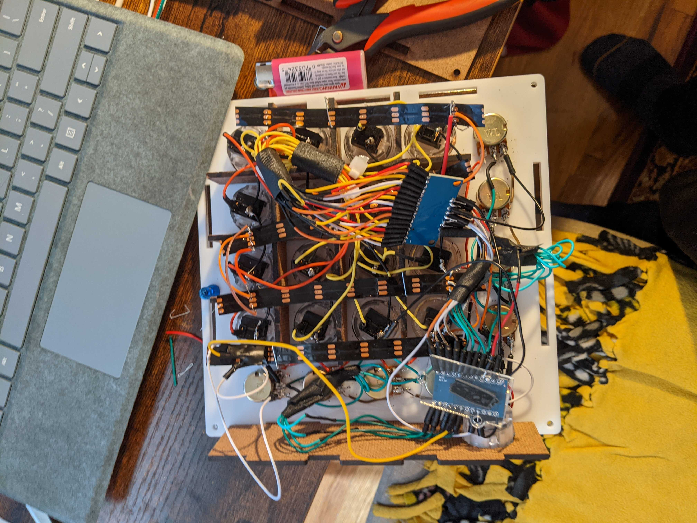

Video @ Demonstration - unstable midi output + only one LED light turns on:

### BEST STATUS
I have no proof of that because it was very brief (less then 20 seconds) but the device would light up and interface with FL Studios to profuce a sample - **however it did that only when I flipped it upsidedown** and I can't replicate it

### DEBUGGING
* I performed a continuity test
* Tested portions of the code on parts of the circuit and nothing was out of the ordinary. 
* I unfortunately have to come to the conclusion that I need to take it apart in order to make this work at that point - which is very upsetting but I fully intend to do it over the winter break

### CURRENT STATUS
The device is recognized as midi input by FL STUDIOS but doesn't produce a sound
LEDs don't respnd to push buttons (makes sense be cause input isn't being read)

### ISSUES
I know I dont have a proof of that but the device did work for like 5 seconds when I moved it from my lap to my desk. It was as if conncections were unstable but
As mentioned. I was able to create a mini version of this citcuit rather easily. but here is where things got very unfortunate for me. Here are the things I didn't consider but were a huge obstacle for meonce I started working on the final circuit. 
1) I didn't check the components before starting to work with them (I didnt test the Ardino)
2) I got a best selling box of wires from amazon, but they were so flimsy and so uncomfortable to use, that they casued so much trouble with the actual circuitry that I believe process that I believe this is why the device is not working right now - the wires are instable
3) I probably soldered over 500 connections together and that could take a real ohysical toll on the hand. I burnt myself multiple times because I was just so fatigued from working with the soldering iron that I may have soldered the wrong connections (though I have done a continuity check and npthing was seemed to be shorted). The quality of the wires certainly didn't help here as they kept ripping with the slitest adjustaments.
4) The arrows on the RGB LED strips were pointing the wrong way! so only one light turned on (because I connected them from the end of the strip rather than the begining. It's fixed now, but I am out of solder at the moment and can't attach all 16 of them together.

## SOFTWARE
This is the code I made in partneship with NerDIY - I have no way to know whether or not this code is fully working because I never actually implemnted the full scope of the design on a breadboard - because that would be a whole lot of breadboard to cover. 
However, I can confidently say that all the different portions of the code were tested and are worked on a smaller scale.
The Code: [LINK]

## FUTURE WORK (WINTER BREAK)
I fully intend to develop this documentation over the course of the winter break and design a pcb for this device. I will keep you posted!

## GALLERY

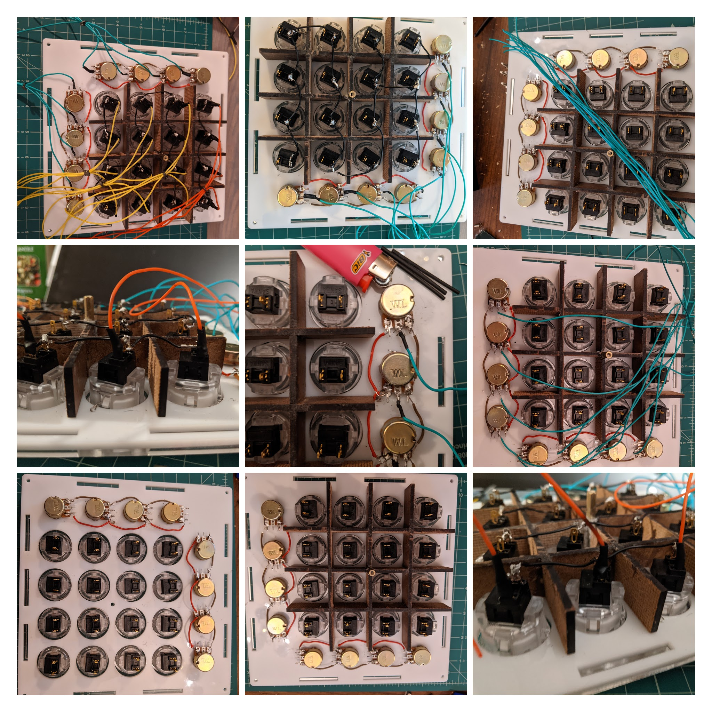
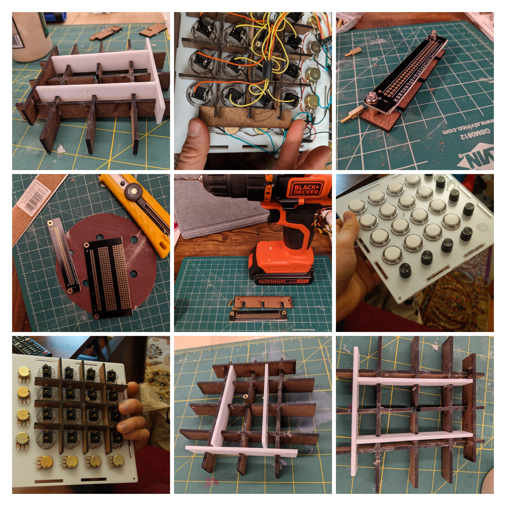
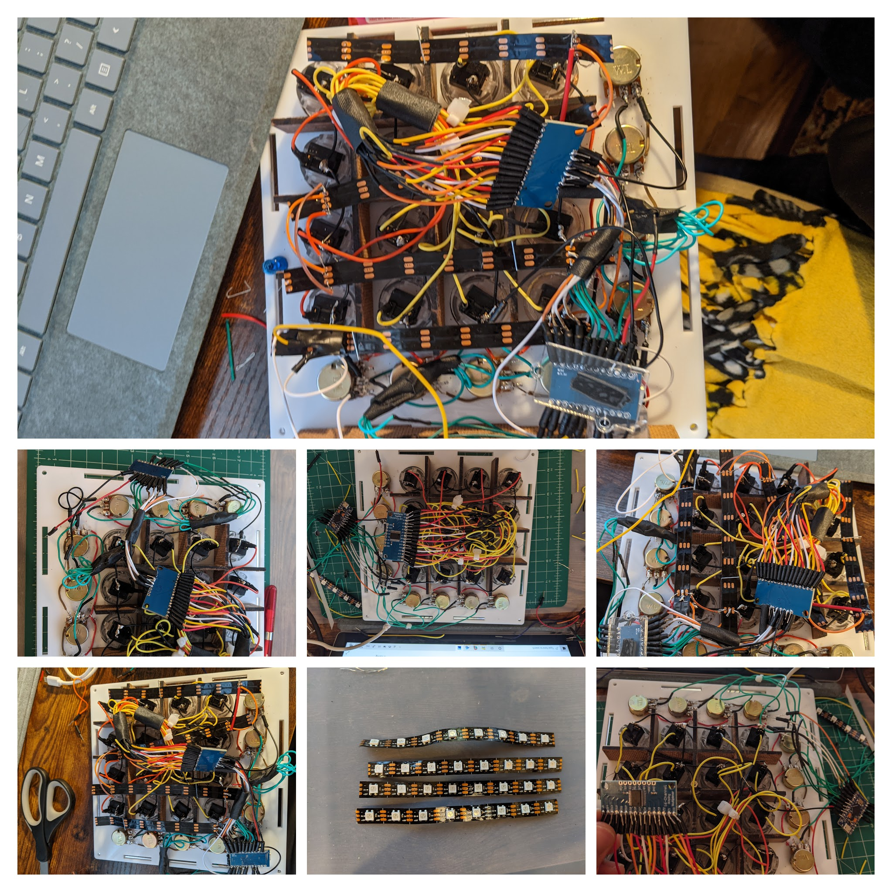

