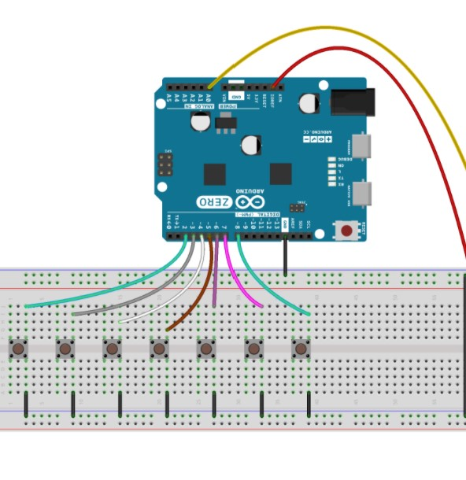
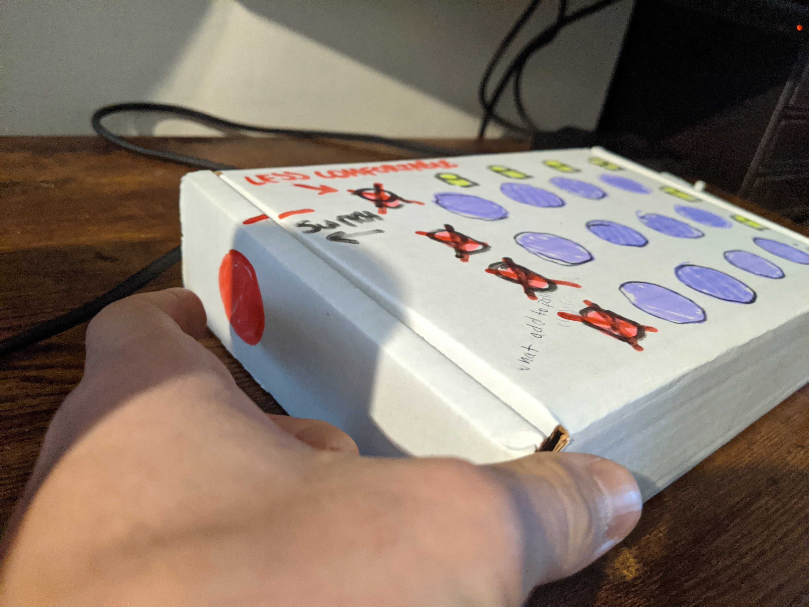
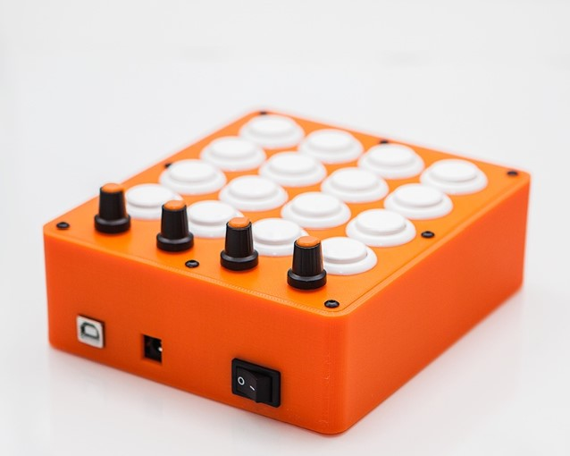
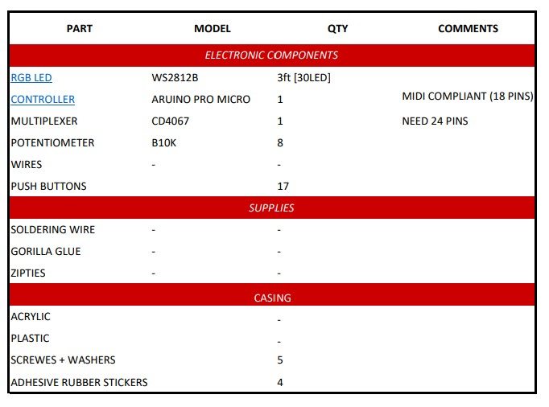

# MIDI CONTROLLER - MUSIC LAUNCHPAD

For the final project I am going to create my own midi controller to create music with.

## WHAT IS A MIDI CONTROLLER?

MIDI (Musical Instrument Digital Interface) is a communication standard that allows digital music gear to speak the same language. A MIDI controller is a device capable of transmitting and recieving these MIDI messages, allowing direct control over mixing programs. Buttons on MIDI controllers are programmable and could be mapped to perform many different functions to optimize workflow or produce different sounds. 

## WHY A MIDI CONTROLLER?
The reason I chode to work on this project is simple. I was more inThis is an **Interactive** Device design class - I took circuits classes before and have done my fair share of microcontroller programming projects, but it was all done with breadboard . I was more interested in creating a good design rather than a complicated circuit and complex code. I did a large portion of the research on understanding the funcitons of a MIDI controller and its different compononent. The bulk of this project was understanding the design process of a product that is intuitive to use. 

## INTERESTING KEY LEARNINGS
That engineers take a lot of things for granted when it comes to design. We often blame ourselves when we can't seem to figure our how to use certain devices. However in reality - it's probably the designer's fault. Which was a very eye openeing concept for me. My first few physical prototypes of the device (NOT the circuit - the enclosure), were fairly simple, but also not informative enough. Most prototypes were recorded, and notes were taken to document how organically the process came through at together at the end.

I didn't consider the travel distance between the buttons
I didn't realize that putting an *ON/OFF* button on the device would be *confusing* to people since the device coud only work when it's *plugged to a computer directly*. In reality when I put a push button for on and off pthe two people that i tested said they percieved the usb port as something that is used to insert content or store data on the device rather than power it.

I made the device way too tall and top heavy (since most of the component are buttons they were mounted at the top).
I did not realize that by mounting things on the bottom and the top of the device I wont be able to 

## FULL DISCLOSURE
There are many implementations and DIY guides out there explaining in detail how to make your own midi controller. So some of the content here is obtained from different sources on the web. However, the main person to help me iterate through the design process was a friendly Youtube channel owner that made some tutorials about how to make midi controllers. He specifically asked me NOT to link his channel because he is not interested in starting to get messages from people on a regular basis. To qupte his words - " I am always happy to help when people ask for my advice, however, I would'nt want to publically volunteer this information so to not get overwhelemd with every little question someone might have, if that makes sense? If you do post these anywhere, please DO NOT link my channel! You can just say - "Thank you nerDIYmusic" and I'll know what that means. so here it is - **Thank you for the help NerDIYMusician** for your help with the enclosure design and code - it was fun! 

### DIAGRAM 

It is important to note that MIDI in itself is NOT a soundwave, nor a musical signal of any sort! It is simply a numeric representation of an action - a hardware interrupt. It could be programmed to include a wide spectrum of properties - for example, vibration to emulate a guitar string being strummed on a synthesizer. However, at it's core, it could be a simple push of a button. The sound that is generated is not coming from the MIDI signal, the signal is converted to a MIDI instruction before its transmitted to the software, and that MIDI software is responsible to convert this instruction into sound. The controller is connected to the software via serial communication in this project.

## EXPERIMENTING

### SIMPLEST FORM
For the sake of visualization - here is an example of what a *very simlpe* MIDI controller could look like.

### PAPER PROTOTYPING 

* **Buttons:** After looking at multiple setups of different MIDI controllers, I decided that since I have never used this kind of device before it would be best to have less buttons then more. So, instead of making a traditional 8X8 array of small silicone buttons I decided to go with a 4X4 array of large arcade push buttons. To make up the difference, I will try to integrate a switch button on the side so that I could switch between 4 different sets of instruments while playing.

* **Sliders Vs Knobs:** I tried to play with different layouts using a piece of paper when deciding between sliders and knobs. The truth is, I couldn't tell the difference that much, both of them were reasonably comfortable to use and rather intuituitive (even with my less than ideal coordination) but ultimately, I ended up choosing to implement only knobs in the design. The simply take much less space and provide the same functionality as sliders and will allow additional sound effects to be loaded.

I am very happy that I did not skip that part of the experimentation because I realized two important things aobut the design. 
   * I will not need an off button since the controller always have to be connected to the computer and will be powered by the Arduino.
   * I originally set out to get 16 buttons - but I actually needed 17! (16 for the main array of synths + 1 to switch between sets of instruments.)
  
*  **Extra Push Button:** ~~I do not know not know where to place the extra button at this point and will have to construct a cardboard prototype for that reason.~~
    * **Update:** found a location for the switch button! I did not intend ot uplpad any pictures of the cardboard prototype to the repo because it was not the most elegant        process of trial and error for me. But from the pictures I took with my phone I noticed my left (non-dominant) hand was resting on the left side of the box. I did it subconciously to hold the box in place when I was trying to pretend to play the push buttons. Noenetheless, after seeing that, it occured to me that this was the most natural position for it because I consistently placed my prototype to the right of my monitor so I could control it with my right hand. That assigned my left hand with the task of traveling between the keyboard and the device (I fully committed to play pretend here, imagining I was actually going through the motinons of uploading different synths and watching the feedback on the screen). Which is why, I now know where to put the switch button!

* **Location of the potentiometers:** I immidiately found out that I wanted to leave space for some of the potentiometers on the top of the box. Since they have a higher profile then all the other components, it wouldn't make much sens to place them closer to me as they would obstruct the push buttons array. This way they will also be accessible to be controlled with both my hands.

  * **Update:**   After I realized I wanted to use 8 potentiometers instead of 4, I could'nt determine whether I wanted them to be on left or the right side of the arcade push buttons array. I initially thought it would be less comfortable for me to use my left hand to control them, but then I realized it wouldn't make much sense to put them on the right side because that would delegate to much responsibility to my right hand. For sanity check, I looked at many other designs and confirmed that this was indeed the case - more often than not, knobs and sliders were placed to the left of the keys.
 
### DIGITAL PROTOTYPING

I found [this](https://www.solidsmack.com/cad/model-week-staal3d-midi-controller-everbody-midi-fightin) beautiful CAD design online. I am going to make some modifications to it and upload them as soon as possible.

## COMPONENTS

* **The Micro Controller:** I looked for a class compliant MIDI chip (plug & play enabled). In other words, the controller cpould be directly connected to the computer without requiring an interface at all. Both the Teensy board and the Arduino Pro Micro were considered. 
Even though I wouldn't have had to buy a multiplexer had I gone with the teensy board (since it has 25 input pins - exactly as much as I need). I opted for an Arduino Pro Micro (18 input pins) + Multiplexer because there is simply much more resources available for it. 
* **Lights:** I chose the RGB LED strips because they would be much more convinient to use without a breadboard. 
* **Buttons:** 16 transparent arcade buttons for the top plate + one on the side. The buttons don't have to be entirely clear, but it is important that they are at least somewhat seathrough so that the LED lights could be seen. This is important not just for decorative purposes - it is also crucial because the light is going to indicate the type of feedback the button is providing (on click, continuous output, etc.)

## CIRCUIT DESIGN

This circuit is incredibly simple (or so I thought). Here is the pin layout:
### PRO MICRO 
* Potentiometers: X8 Analog Pins (A0-A3 & 6-9)
* Side Pushbutton: X1 Digital Pin (3)
* 16-LED Strips: X1 Analog Pin (5)
### Arduino - Multiplexer 
ArduinoPin-MultiplexerPin     
  * Digital Pin 2 - S0
  * Digital Pin 15 (SCLK) - S1
  * Digital Pin 16 (MOSI) - S2
  * Digital Pin 14 (MISO) - S3
  * Digital Pin 10 - SIG
  
### MULTIPLEXER
* 16 Push-Buttons: X16 Digital Pins (C0-C15)
* Enable was connected with ground 

## FRITZING SCHEMATIC 

**Note:** There original design called for resistors but I decided to not include them and integrate 
## BREADBOARD PROTOTYPE DESIGN

## NOT
## CODE

## FINAL DESIGN
Conclusion - Continuoity check was done, and similar code was uploaded 
## ISSUES

## FUTURE WORK (WINTER BREAK)
