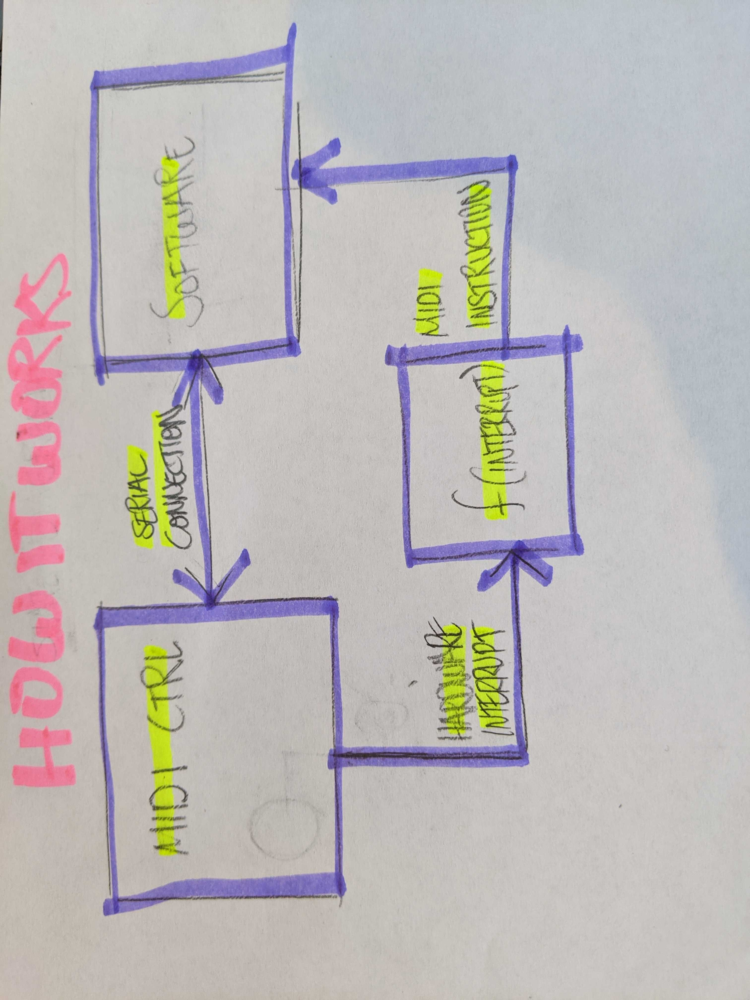

# MIDI CONTROLLER - MUSIC LAUNCHPAD

For the final project I am going to create my own midi controller to create music with.

## WHAT IS A MIDI CONTROLLER?

MIDI (Musical Instrument Digital Interface) is a communication standard that allows digital music gear to speak the same language. A MIDI controller is a device capable of transmitting and recieving these MIDI messages, allowing direct control over mixing programs. Buttons on MIDI controllers are programmable and could be mapped to perform many different functions to optimize workflow or produce different sounds. 

## HOW IT WORKS?

### DIAGRAM 

It is important to note that MIDI in itself is NOT a soundwave, nor a musical signal of any sort! It is simply a numeric representation of an action - a hardware interrupt. It could be programmed to include a wide spectrum of properties - for example, vibration to emulate a guitar string being strummed on a synthesizer. However, at it's core, it could be a simple push of a button. The sound that is generated is not coming from the MIDI signal, the signal is converted to a MIDI instruction before its transmitted to the software, and that MIDI software is responsible to convert this instruction into sound. The controller is connected to the software via serial communication in this project.

## EXPERIMENTING

### SIMPLEST FORM
Here is an example of what a simlpe MIDI controller.

### PAPER PROTOTYPING 

* Buttons: After looking at multiple setups of different MIDI controllers, I decided that since I have never used this kind of device before it would be best to have less buttons then more. So, instead of making a traditional 8X8 array of small silicone buttons I decided to go with a 4X4 array of large arcade push buttons. To make up the difference, I will try to integrate a switch button on the side so that I could switch between 4 different sets of instruments while playing.

* Sliders Vs Knobs: I tried to play with different layouts using a piece of paper when deciding between sliders and knobs. The truth is, I couldn't tell the difference that much, both of them were reasonably comfortable to use and rather intuituitive (even with my less than ideal coordination) but ultimately, I ended up choosing to implement only knobs in the design. The simply take much less space and provide the same functionality as sliders and will allow additional sound effects to be loaded.

*I am very happy that I did not skip that part of the experimentation because I realized two important things aobut the design. 
  1) I will not need an off button since the controller always have to be connected to the computer and will be powered by the Arduino.
  2) I originally set out to get 16 buttons - but I actually needed 17! (16 for the main array of synths + 1 to switch between sets of instruments.)
  
*I do not know not know where to place the extra button at this point and will have to construct a cardboard prototype for that reason - comming soon*

### COMPONENTS

* The Micro Controller - I looked for a class compliant MIDI chip (plug & play enabled). In other words, the controller cpould be directly connected to the computer without requiring an interface at all. Both the Teensy board and the Arduino Pro Micro were considered. 
Even though I wouldn't have had to buy a multiplexer had I gone with the teensy board (since it has 25 input pins - exactly as much as I need). I opted for an Arduino Pro Micro (18 input pins) + Multiplexer because there is simply much more resources available for it. 
* I chose the RGB LED strips because they would be much more convinient to use without a breadboard.
* Buttons: I originally thought to 

### DIGITAL PROTOTYPING

The cad designs are coming soon as well. I first need to determine where to place the switch button.

## CIRCUIT DESIGN
* comming soon
## CODE
* coming soon

